# 🍽️ NutriOps Platform


Plataforma operativa para la gestión y análisis de servicios de alimentación institucional, orientada a entornos como hospitales, universidades y casinos corporativos.

NutriOps permite monitorear consumos, visualizar indicadores en tiempo real, administrar operaciones y apoyar la toma de decisiones mediante dashboards interactivos, reportes y herramientas de carga de datos.

---

## 🏥 Contexto real

Este sistema fue diseñado para gestionar el flujo de alimentación en entornos reales como hospitales, donde es necesario:

- Controlar el aforo en tiempo real
- Registrar consumos por tipo de comida
- Evitar sobrecapacidad del casino
- Analizar patrones de consumo

El sistema simula condiciones reales mediante datos históricos y generación de consumo realista.

---

## Características principales

- Dashboards operacionales en tiempo real
- Visualización en vivo mediante SSE (Server-Sent Events)
- Gestión de consumo por tipo de comida: desayuno, almuerzo y once
- Reportes y analítica de consumo
- Gestión de usuarios por roles
- Arquitectura modular tipo monorepo
- Módulo kiosk para registro de consumos
- Carga de menú semanal mediante plantilla Excel
- Base de datos inicial reproducible para entorno local

---

## Arquitectura

El proyecto sigue una arquitectura modular basada en monorepo:

```text
nutriops-platform
│
├── apps
│   ├── api         # Backend (Node.js + Express)
│   ├── web         # Dashboard administrativo (Vue 3 + Vite + TypeScript)
│   └── kiosk       # Interfaz tipo tótem / terminal
│
├── scripts         # Seeds y utilidades de carga de datos
├── database        # Base de datos inicial reproducible
├── templates       # Plantillas Excel para pruebas de carga
├── package.json
└── README.md
```

### Módulos

- **api**: autenticación, lógica de negocio, servicios y acceso a datos
- **web**: dashboard administrativo con visualización en tiempo real
- **kiosk**: interfaz para registro de consumos en terminales
- **scripts**: seeds y generación de datos de prueba
- **database**: estructura SQL inicial del sistema
- **templates**: plantilla Excel para carga de menú

---

## Tiempo real con SSE

NutriOps utiliza **Server-Sent Events (SSE)** para enviar datos desde el servidor al cliente en tiempo real.

### Uso dentro del sistema

- Aforo en vivo
- Actividad del casino
- Consumo del día
- Actualización automática de dashboards

### ¿Por qué SSE?

- Más simple que WebSockets
- Ideal para dashboards
- Comunicación unidireccional eficiente

---

## Stack tecnológico

### Frontend
- Vue 3
- Vite
- TypeScript

### Backend
- Node.js
- Express

### Base de datos
- MySQL / MariaDB

### Librerías clave
- bcryptjs
- dotenv
- mysql2

---

## Requisitos previos

- Node.js 18+
- npm
- MySQL o MariaDB
- Git

---

## ⚙️ Instalación y ejecución

### 1. Clonar repositorio

```bash
git clone https://github.com/mvargascode/nutriops-platform.git
cd nutriops-platform
```

### 2. Instalar dependencias

```bash
npm install
```

### 3. Instalar dependencias para scripts

```bash
npm install bcryptjs dotenv mysql2
```

### 4. Configurar variables de entorno

Crear archivo `.env` en la raíz:

```env
DB_HOST=localhost
DB_PORT=3306
DB_NAME=casino_nutriops
DB_USER=root
DB_PASSWORD=tu_password
JWT_SECRET=super_secret_key
```

---

### 5. Importar base de datos

El proyecto incluye:

```text
database/database.sql
```

Importar con:

```bash
mysql -u root -p < database/database.sql
```

---

### 6. Crear usuarios demo

```bash
node scripts/seed-demo-users.js
```

---

### 7. Generar datos de prueba

```bash
node scripts/seed-consumos-60dias.js
node scripts/seed-hoy-almuerzo.js
node scripts/seed-hoy-desayuno-almuerzo.js
```

---

### 8. Ejecutar sistema

#### Backend
```bash
npm run dev:api
```

#### Frontend
```bash
npm run dev:web
```

#### Kiosk
```bash
npm run dev:kiosk
```

---

## Datos de prueba (Seeds)

Scripts disponibles:

```bash
node scripts/seed-demo-users.js
node scripts/seed-consumos-60dias.js
node scripts/seed-hoy-almuerzo.js
node scripts/seed-hoy-desayuno-almuerzo.js
```

---

## Usuarios demo

| Rol        | Usuario | Contraseña |
|-----------|--------|-----------|
| Admin     | admin  | admin123  |
| Nutricion | nutri  | nutri123  |
| RRHH      | rrhh   | rrhh123   |

Se crean con:

```bash
node scripts/seed-demo-users.js
```

---

## Plantilla Excel

Ubicación:

```text
templates/
```

Permite simular la carga de menú semanal en el sistema.

### Uso

1. Abrir plantilla Excel
2. Completar hoja de datos
3. Subir archivo al sistema
4. Validar en `nutricion_diaria`

---

## Funcionalidades

- Monitoreo de aforo
- Registro de consumos
- Visualización en tiempo real
- Reportes históricos
- Gestión de usuarios
- Carga de menú vía Excel

---

## 📸 Screenshots

### Dashboard Público
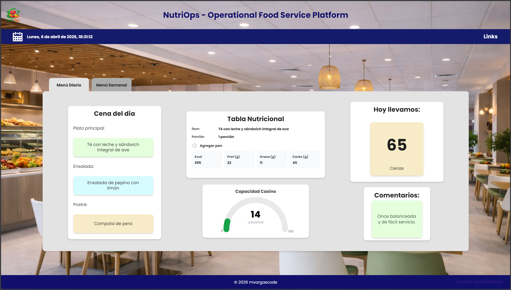

### Menú Semanal - Dashboard Público
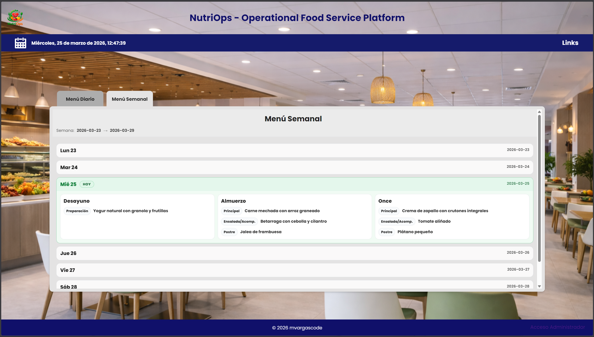

### Login
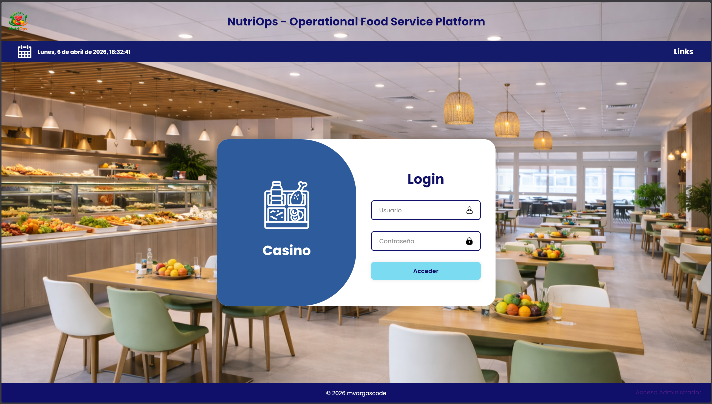

### Admin Dashboard Operativo
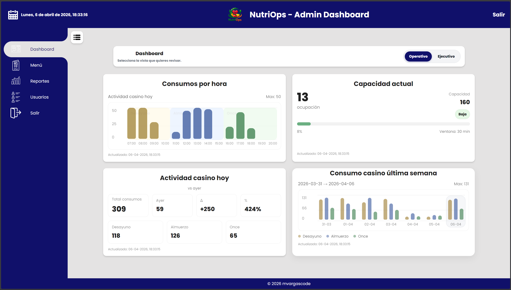

### Admin Dashboard Ejecutivo
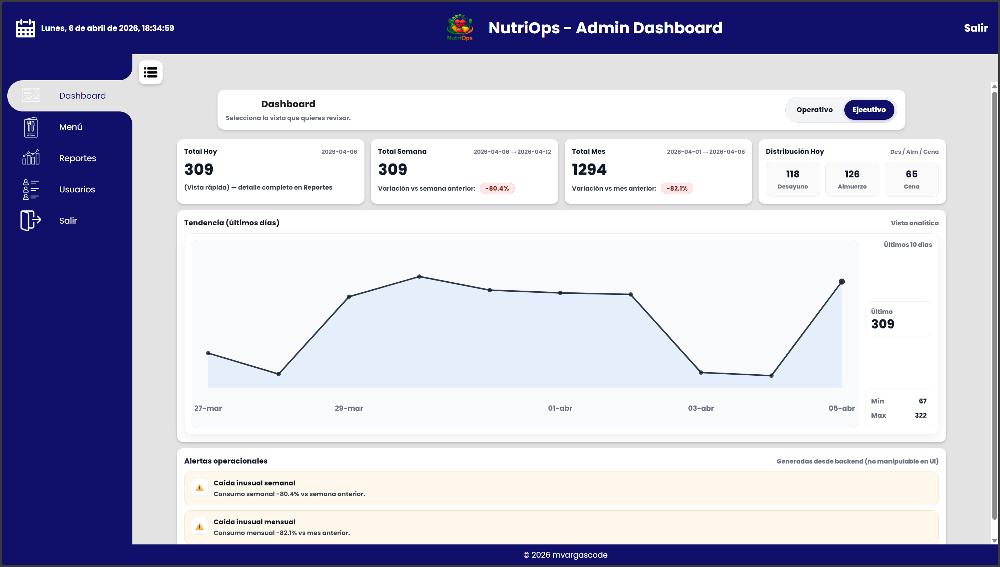

### Gestión Menú
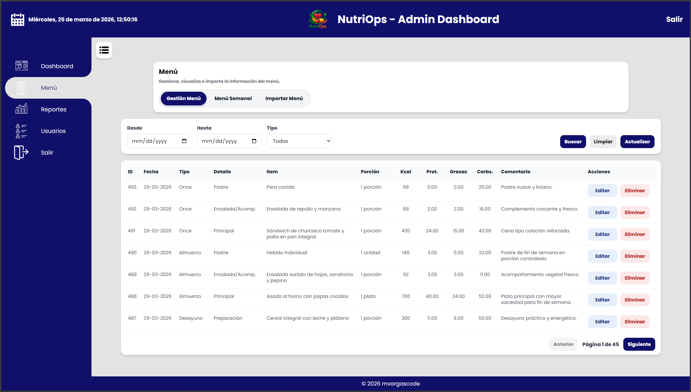

### Menú Semanal - Admin Dashboard
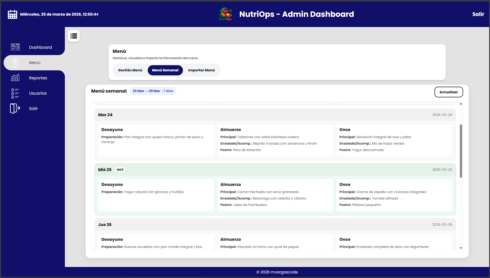

### Importar Menú - Admin Dashboard
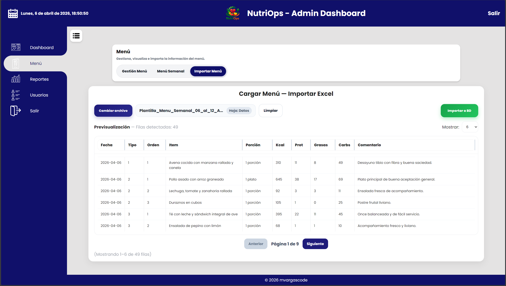

### Reportes - Admin Dashboard
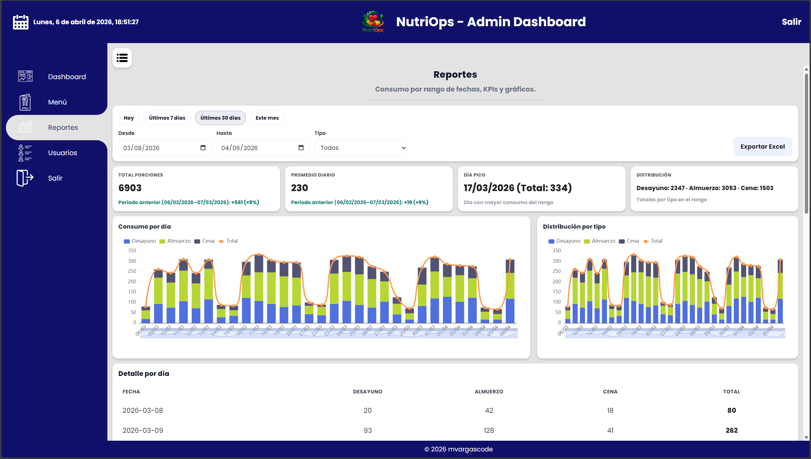

### Reportes - Admin Dashboard
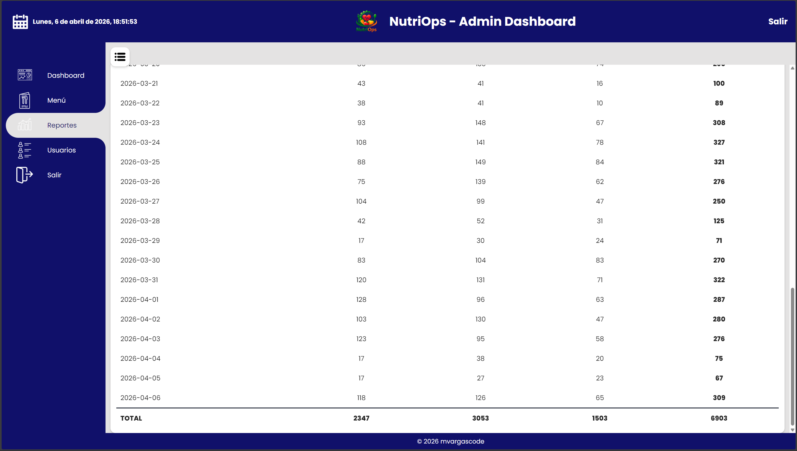

### Usuarios - Admin Dashboard
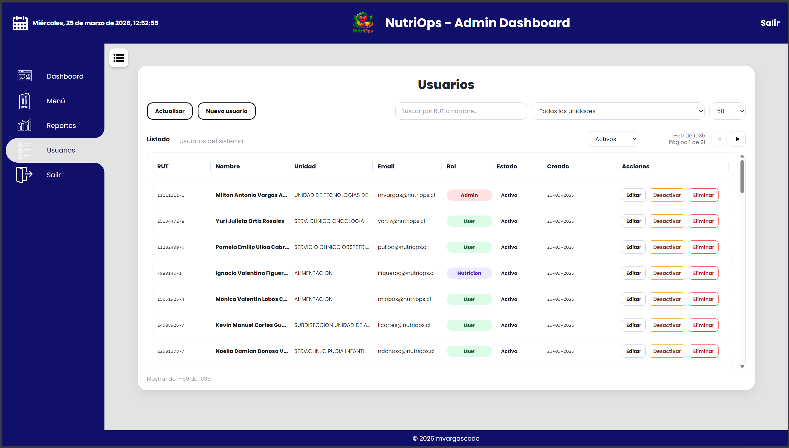

### Tótem NutriOps
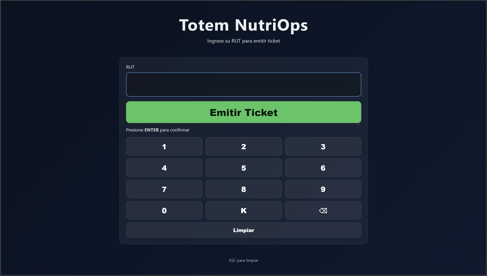

---

## 🧠 Aprendizajes

Durante el desarrollo de este proyecto se abordaron desafíos reales como:

- Implementación de SSE para dashboards en tiempo real
- Diseño de arquitectura modular en monorepo
- Modelado de datos para consumo alimentario
- Manejo de roles y autenticación en backend
- Generación de datos realistas para testing

---

## Estado del proyecto

Proyecto en desarrollo activo con mejoras continuas en arquitectura, rendimiento y visualización.

---

## Autor

**Milton Vargas**  
Software Engineer | Backend, Systems & Infrastructure

- GitHub: https://github.com/mvargascode  
- LinkedIn: https://www.linkedin.com/in/miltonvargasa  

---

## Licencia

MIT License
