# 🍽️ NutriOps Platform


Plataforma operativa para la gestión y análisis de servicios de alimentación institucional, orientada a entornos como hospitales, universidades y casinos corporativos.

NutriOps permite monitorear consumos, visualizar indicadores en tiempo real, administrar operaciones y apoyar la toma de decisiones mediante dashboards interactivos, reportes y herramientas de carga de datos.

---

## 🚀 Demo en vivo

El sistema está desplegado en producción, con datos reales y un job programado que simula actividad de forma realista durante los horarios de servicio — no es data estática.

| Módulo | URL |
|---|---|
| 🖥️ Dashboard público (menú del día, ocupación en vivo) | [nutriops-platform.vercel.app](https://nutriops-platform.vercel.app) |
| 🎫 Tótem (registro de consumo por RUT) | [nutriops-totem.vercel.app](https://nutriops-totem.vercel.app) |
| 🔌 API | Desplegada en Railway (backend de ambos módulos de arriba) |

**Acceso administrador** (link "Acceso Administrador" al pie del dashboard público):

| Rol | Usuario | Contraseña |
|---|---|---|
| Admin | `admin` | `admin123` |
| Nutrición | `nutri` | `nutri123` |
| RRHH | `rrhh` | `rrhh123` |

**Para probar el tótem**, cualquiera de estos RUT de demo emite un ticket válido según la hora real (desayuno 07-09h, almuerzo 11-16h, cena 20-24h):

```
11.111.111-1   22.222.222-2   33.333.333-3
```

---

## 🏥 Contexto real

Este sistema fue diseñado para gestionar el flujo de alimentación en entornos reales como hospitales, donde es necesario:

- Controlar el aforo en tiempo real
- Registrar consumos por tipo de comida
- Evitar sobrecapacidad del casino
- Analizar patrones de consumo

El sistema simula condiciones reales mediante datos históricos y generación de consumo realista.

---

## Características principales

- Dashboards operacionales en tiempo real
- Visualización en vivo mediante SSE (Server-Sent Events)
- Gestión de consumo por tipo de comida: desayuno, almuerzo y cena
- Reportes y analítica de consumo
- Gestión de usuarios por roles
- Arquitectura modular tipo monorepo
- Módulo kiosk para registro de consumos
- Carga de menú semanal mediante plantilla Excel
- Simulador de actividad en tiempo real para la demo (job programado con Railway Cron)
- Diseño responsive (móvil, tablet y escritorio) en dashboard público, panel admin y kiosk
- Base de datos inicial reproducible para entorno local

---

## Arquitectura

El proyecto sigue una arquitectura modular basada en monorepo:

```text
nutriops-platform
│
├── apps
│   ├── api         # Backend (Node.js + Express)
│   ├── web         # Dashboard administrativo (Vue 3 + Vite + TypeScript)
│   └── kiosk       # Interfaz tipo tótem / terminal
│
├── scripts         # Seeds y utilidades de carga de datos
├── database        # Base de datos inicial reproducible
├── templates       # Plantillas Excel para pruebas de carga
├── package.json
└── README.md
```

### Módulos

- **api**: autenticación, lógica de negocio, servicios y acceso a datos
- **web**: dashboard administrativo con visualización en tiempo real
- **kiosk**: interfaz para registro de consumos en terminales
- **scripts**: seeds y generación de datos de prueba
- **database**: estructura SQL inicial del sistema
- **templates**: plantilla Excel para carga de menú

### Infraestructura de producción

| Componente | Servicio |
|---|---|
| API + Base de datos MySQL | [Railway](https://railway.com) |
| Dashboard público + panel admin (`apps/web`) | [Vercel](https://vercel.com) |
| Tótem (`apps/kiosk`) | [Vercel](https://vercel.com) |
| Simulador de actividad | Railway Cron Service (cada 10 min, solo durante horarios de servicio) |

---

## Tiempo real con SSE

NutriOps utiliza **Server-Sent Events (SSE)** para enviar datos desde el servidor al cliente en tiempo real.

### Uso dentro del sistema

- Aforo en vivo
- Actividad del casino
- Consumo del día
- Actualización automática de dashboards

### ¿Por qué SSE?

- Más simple que WebSockets
- Ideal para dashboards
- Comunicación unidireccional eficiente

---

## Stack tecnológico

### Frontend
- Vue 3
- Vite
- TypeScript

### Backend
- Node.js
- Express

### Base de datos
- MySQL / MariaDB

### Librerías clave
- bcryptjs
- dotenv
- mysql2

---

## Requisitos previos

- Node.js 18+
- npm
- MySQL o MariaDB
- Git

---

## ⚙️ Instalación y ejecución

### 1. Clonar repositorio

```bash
git clone https://github.com/mvargascode/nutriops-platform.git
cd nutriops-platform
```

### 2. Instalar dependencias

```bash
npm install
```

### 3. Instalar dependencias para scripts

```bash
npm install bcryptjs dotenv mysql2
```

### 4. Configurar variables de entorno

Crear archivo `.env` en la raíz:

```env
DB_HOST=localhost
DB_PORT=3306
DB_NAME=casino_nutriops
DB_USER=root
DB_PASSWORD=tu_password
JWT_SECRET=super_secret_key
```

---

### 5. Importar base de datos

El proyecto incluye:

```text
database/database.sql
```

Importar con:

```bash
mysql -u root -p < database/database.sql
```

---

### 6. Crear usuarios demo

```bash
node scripts/seed-demo-users.js
```

---

### 7. Generar datos de prueba

```bash
node scripts/seed-consumos-60dias.js
node scripts/seed-hoy-almuerzo.js
node scripts/seed-hoy-desayuno-almuerzo.js
```

---

### 8. Ejecutar sistema

#### Backend
```bash
npm run dev:api
```

#### Frontend
```bash
npm run dev:web
```

#### Kiosk
```bash
npm run dev:kiosk
```

---

## Datos de prueba (Seeds)

Scripts disponibles:

```bash
node scripts/seed-demo-users.js
node scripts/seed-consumos-60dias.js
node scripts/seed-hoy-almuerzo.js
node scripts/seed-hoy-desayuno-almuerzo.js
```

---

## Usuarios demo

| Rol        | Usuario | Contraseña |
|-----------|--------|-----------|
| Admin     | admin  | admin123  |
| Nutricion | nutri  | nutri123  |
| RRHH      | rrhh   | rrhh123   |

Se crean con:

```bash
node scripts/seed-demo-users.js
```

---

## Plantilla Excel

Ubicación:

```text
templates/
```

Permite simular la carga de menú semanal en el sistema. También se puede descargar directamente desde el panel admin (Menú → Importar Menú → "Descargar plantilla").

### Uso

1. Abrir plantilla Excel
2. Completar hoja de datos
3. Subir archivo al sistema
4. Validar en `nutricion_diaria`

---

## Funcionalidades

- Monitoreo de aforo
- Registro de consumos
- Visualización en tiempo real
- Reportes históricos y exportación a Excel
- Gestión de usuarios
- Carga de menú vía Excel

---

## 📸 Screenshots

### Dashboard Público
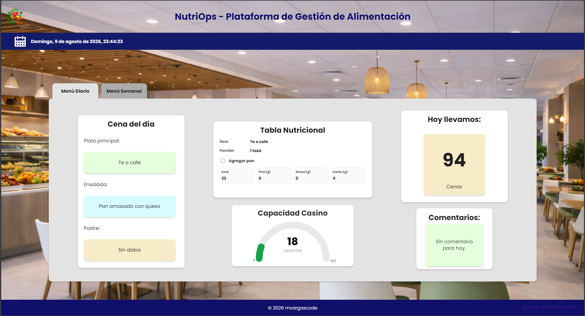

### Menú Semanal - Dashboard Público
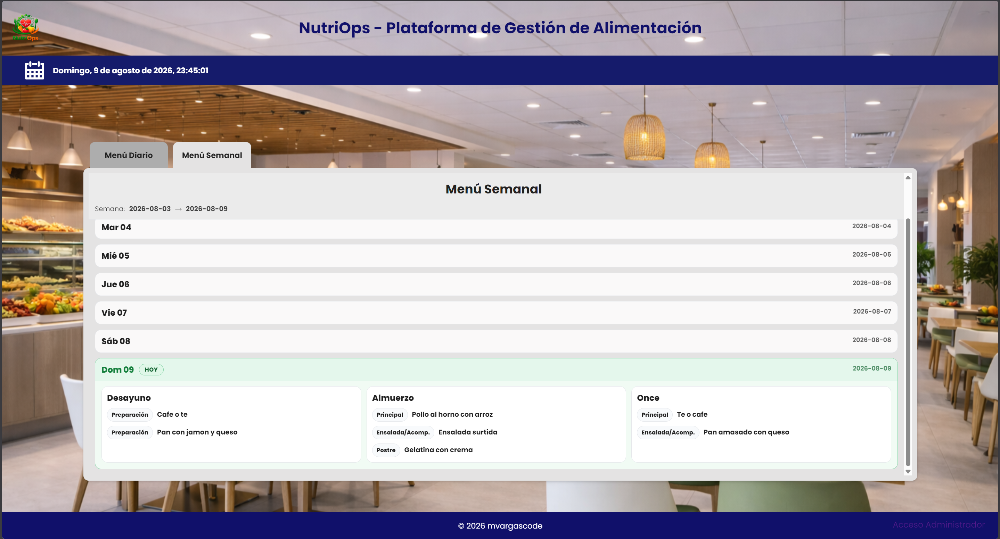

### Login
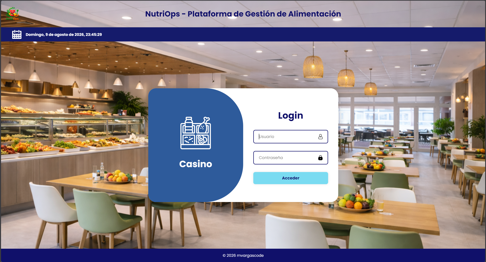

### Admin Dashboard Operativo
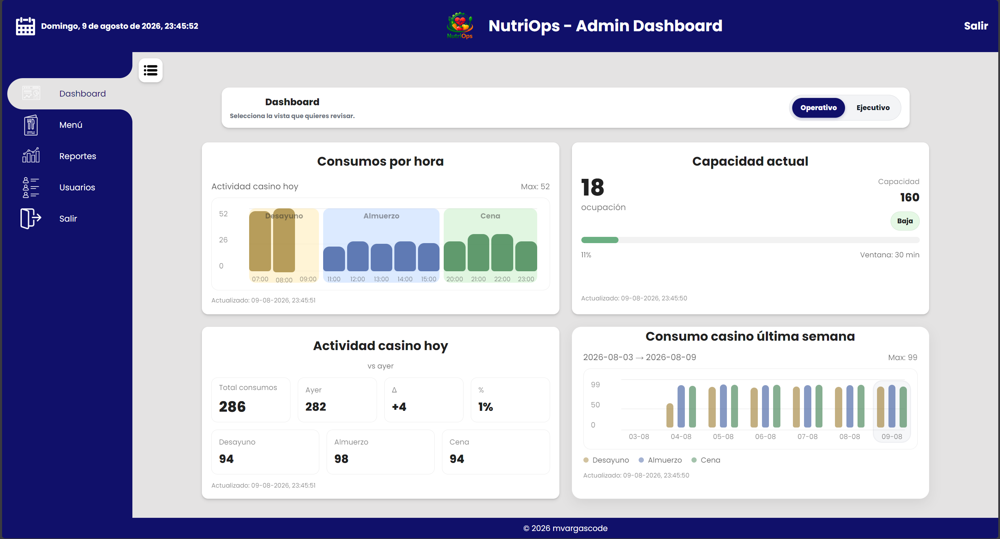

### Admin Dashboard Ejecutivo
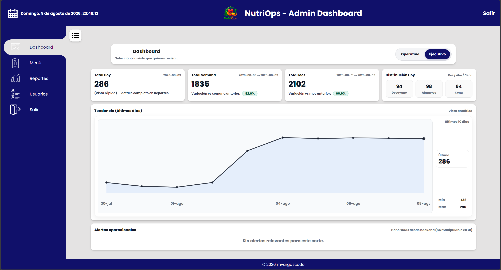

### Gestión Menú
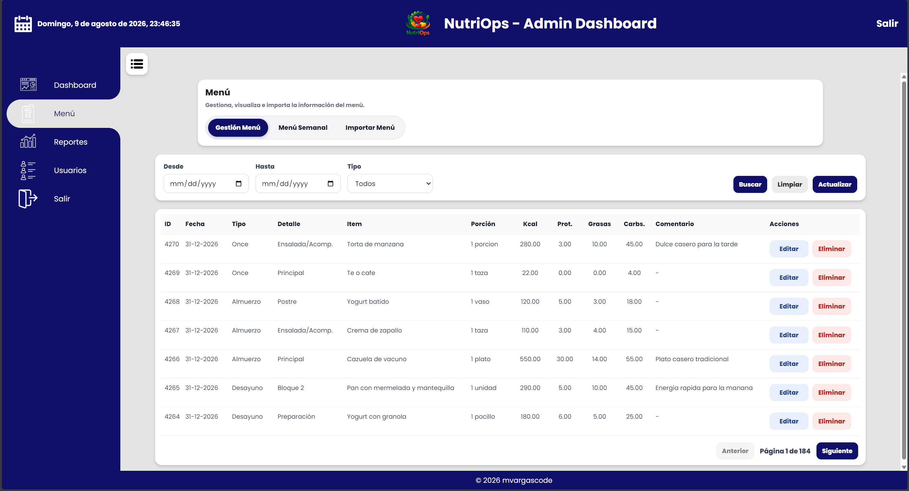

### Menú Semanal - Admin Dashboard
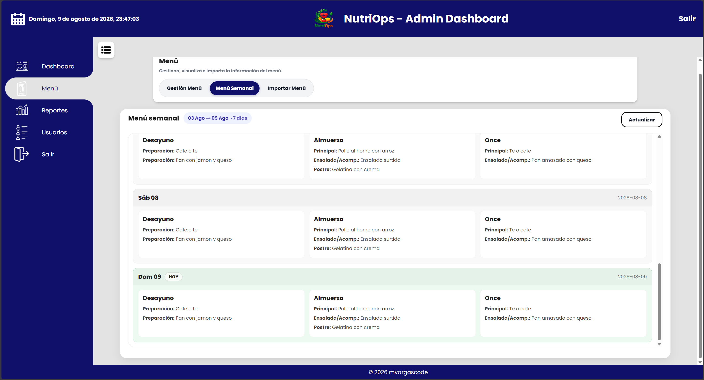

### Importar Menú - Admin Dashboard
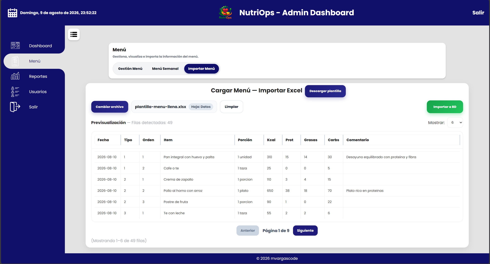

### Reportes - Admin Dashboard
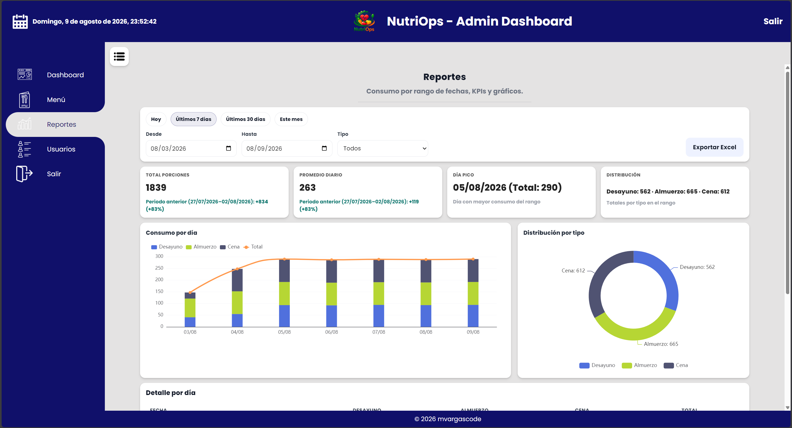

### Reportes - Admin Dashboard
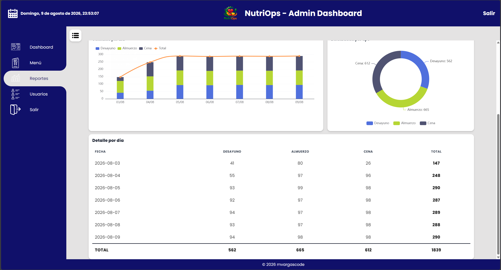

### Usuarios - Admin Dashboard
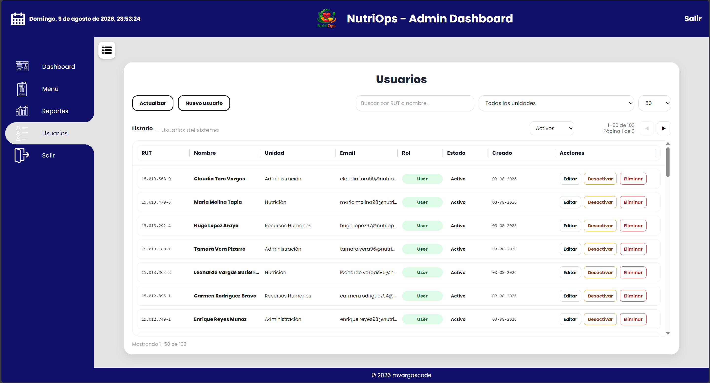

### Tótem NutriOps
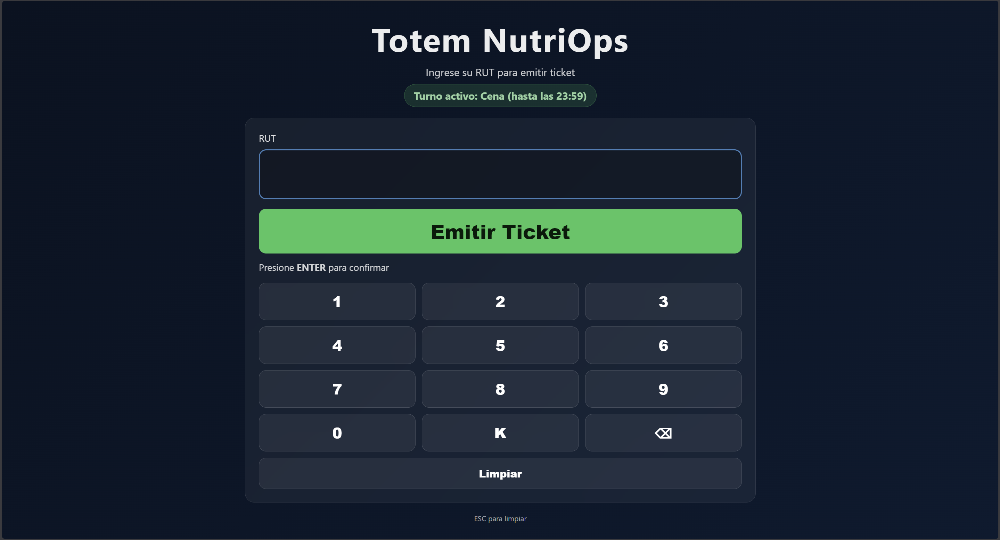

---

## 🧠 De desarrollo local a producción: aprendizajes reales

Este proyecto empezó como un prototipo funcional en local. Llevarlo a producción (Railway + Vercel) sacó a la luz una serie de bugs que nunca se habían manifestado en desarrollo, y que fue necesario diagnosticar y resolver uno por uno:

- **Build de producción vs. desarrollo**: el proyecto corría en local con `ts-node-dev` (sin build real). Al compilar con `tsc` para producción, apareció que la configuración de TypeScript generaba el output en una ruta distinta a la que el script de arranque esperaba, y que los alias de import (`@/`) no se resolvían fuera de desarrollo sin registrar `tsconfig-paths` en tiempo de ejecución.
- **Zona horaria del contenedor**: los contenedores de Railway corren en UTC, mientras que toda la lógica de horarios de servicio (desayuno/almuerzo/cena) está pensada en hora de Chile. Esto causó fallas silenciosas cerca de los límites de cada turno — desde el tótem rechazando registros en plena hora de servicio, hasta alertas operativas comparando períodos de distinta duración — hasta centralizar el cálculo de hora usando `Intl.DateTimeFormat` con `timeZone: 'America/Santiago'`.
- **Codificación UTF-8**: una carga inicial de datos vía consola resultó en doble-codificación de caracteres con tilde, resuelta con una conversión `CONVERT(...USING latin1...USING utf8mb4)`.
- **SSE + autenticación**: la API nativa `EventSource` del navegador no puede enviar headers personalizados, lo que rompía la autenticación de los streams en tiempo real para usuarios logueados. Se resolvió aceptando el token también por query string para esas rutas específicas.
- **Pool de conexiones**: bajo carga de múltiples streams SSE simultáneos, el límite por defecto del pool de conexiones a MySQL resultó insuficiente, generando timeouts intermitentes — visible en las métricas como requests en cola sin que hubiera presión real de CPU o memoria.
- **Simulación de actividad realista**: se implementó un job programado (Railway Cron) que reparte el registro de consumos a lo largo de cada ventana horaria de forma proporcional al tiempo transcurrido, en vez de saturar el cupo del día de golpe — así la demo se ve viva y creíble en cualquier momento que alguien la visite.
- **Auditoría de lógica de negocio**: una revisión sistemática de dashboards, reportes y alertas operacionales (comparando cada número contra la base de datos directamente) encontró varios bugs reales más allá de lo visual — un gráfico que renderizaba los datos equivocados, y una alerta de "caída de consumo" que se disparaba en falso por comparar un mes parcial contra un mes completo.
- **Responsividad**: el diseño original no tenía cobertura de `@media queries` en gran parte del dashboard, panel admin y tótem. Se hizo una revisión sistemática módulo por módulo (layout con grid/flexbox, gráficos que se redimensionan con su contenedor, tablas con scroll horizontal contenido) para que la plataforma sea usable en celular, tablet y escritorio.

---

## 🧠 Aprendizajes

Durante el desarrollo de este proyecto se abordaron desafíos reales como:

- Implementación de SSE para dashboards en tiempo real
- Diseño de arquitectura modular en monorepo
- Modelado de datos para consumo alimentario
- Manejo de roles y autenticación en backend
- Generación de datos realistas para testing
- Diagnóstico y resolución de bugs específicos de producción (zona horaria, build, encoding, pool de conexiones)
- Despliegue y operación real en Railway + Vercel, incluyendo jobs programados

---

## Estado del proyecto

Proyecto desplegado y en mejora continua. Esta es una **demo pública con fines de portafolio** — los datos de usuarios, consumos y menú son simulados.

---

## Autor

**Milton Vargas**
Software Engineer | Backend, Systems & Infrastructure

- GitHub: https://github.com/mvargascode
- LinkedIn: https://www.linkedin.com/in/miltonvargasa

---

## Licencia

MIT License
